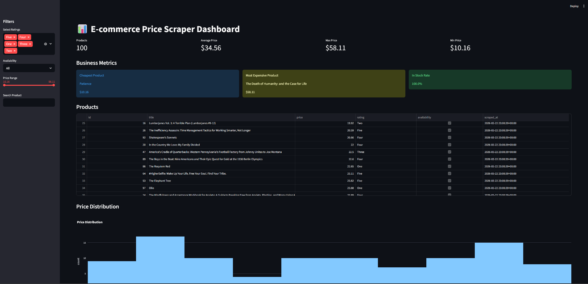

🇧🇷 Portuguese version available here:
[README_PTBR.md](README_PTBR.md)

# 🚀 E-commerce Price Scraper & Analytics Dashboard

A production-ready web scraping and analytics platform built with Python, PostgreSQL, SQLAlchemy, Streamlit, multithreading, and modern scraping strategies.

This project was designed to simulate real-world freelance automation and data engineering jobs commonly found on platforms like Workana, Upwork, and Fiverr.

---

# Dashboard Preview



# Scraper Demo

![Filters](assets/scraper

# ✨ Features

## 🔎 Advanced Web Scraping

* Concurrent multithreaded scraping
* Retry logic and timeout handling
* Randomized User-Agent rotation
* BeautifulSoup HTML parsing
* Clean service-based architecture
* Scalable scraper factory pattern
* Modular scraping engines

---

## 🗄️ PostgreSQL Database Integration

* SQLAlchemy ORM
* Relational data modeling
* Historical price tracking
* Automatic table creation
* Persistent product storage
* Timestamped price history

---

## 📈 Analytics Dashboard

Interactive Streamlit dashboard with:

* KPI metrics
* Price distribution analysis
* Rating analytics
* Historical price tracking
* Dynamic filtering
* Search functionality
* Real-time PostgreSQL queries
* Interactive Plotly charts

---

## 📊 Export Automation

* Excel export
* CSV export
* Automated formatting
* Data cleaning pipeline
* Dashboard-ready datasets

---

## 🧠 Engineering Highlights

* Layered architecture
* Service-oriented design
* Environment-based configuration
* Scalable project structure
* Docker-ready setup
* Clean logging system
* CLI support
* Database normalization

---

# 🏗️ Architecture

```text
src/
│
├── api/
├── core/
├── dashboard/
├── database/
├── jobs/
├── models/
├── scraper/
├── scripts/
├── services/
│
├── main.py
│
config/
database/
logs/
output/
tests/
```

---

# 🧩 Tech Stack

| Technology         | Purpose             |
| ------------------ | ------------------- |
| Python             | Core language       |
| PostgreSQL         | Relational database |
| SQLAlchemy         | ORM                 |
| Streamlit          | Dashboard           |
| Plotly             | Interactive charts  |
| BeautifulSoup      | HTML parsing        |
| Requests           | HTTP requests       |
| Pandas             | Data processing     |
| OpenPyXL           | Excel automation    |
| Docker             | Containerization    |
| ThreadPoolExecutor | Concurrency         |

---

# 📦 Database Schema

## Products

| Column       | Type      |
| ------------ | --------- |
| id           | Integer   |
| title        | String    |
| rating       | String    |
| availability | Boolean   |
| created_at   | Timestamp |
| updated_at   | Timestamp |

---

## Product Prices

| Column     | Type        |
| ---------- | ----------- |
| id         | Integer     |
| product_id | Foreign Key |
| price      | Float       |
| scraped_at | Timestamp   |

---

# 📸 Dashboard Preview

## Included Analytics

* Total products
* Average price
* Highest price
* Product table
* Price distribution histogram
* Ratings chart
* Historical price evolution

---

# ⚙️ Installation

## 1. Clone repository

```bash
git clone <YOUR_GITHUB_REPOSITORY>
cd ecommerce-price-scraper
```

---

## 2. Create virtual environment

### Windows

```bash
python -m venv venv
venv\Scripts\activate
```

### Linux / Mac

```bash
python3 -m venv venv
source venv/bin/activate
```

---

## 3. Install dependencies

```bash
pip install -r requirements.txt
```

---

# 🐘 PostgreSQL Setup

## Docker Compose

```bash
docker-compose up -d
```

---

## Example .env

```env
DB_HOST=localhost
DB_PORT=5432
DB_NAME=price_scraper
DB_USER=admin
DB_PASSWORD=admin
```

---

# ▶️ Running the Scraper

```bash
python -m src.main
```

---

# 📊 Running the Dashboard

```bash
streamlit run src/dashboard/app.py
```

---

# 🧪 Running Tests

## Raw PostgreSQL connection

```bash
python -m tests.raw_connection
```

## SQLAlchemy connection

```bash
python -m tests.test_sqlalchemy
```

---

# 📁 Generated Outputs

The application automatically generates:

* Excel reports
* CSV exports
* PostgreSQL records
* Historical pricing data
* Interactive dashboard analytics
* Log files

---

# 🔥 Real-World Freelance Applications

This project demonstrates skills commonly requested in freelance jobs involving:

* Web scraping
* E-commerce monitoring
* Competitor analysis
* Data pipelines
* Automation
* Dashboard development
* ETL processes
* Database engineering
* Business intelligence
* Data visualization

---

# 🛠️ Future Improvements

Planned enhancements:

* Selenium integration
* Playwright integration
* CAPTCHA bypass strategies
* Proxy rotation
* Scheduling with cron jobs
* REST API
* FastAPI backend
* AI-based price prediction
* Email alerts
* Cloud deployment
* Kubernetes orchestration

---

# 📌 Example Use Cases

## E-commerce Monitoring

Track competitors' pricing automatically.

## Marketplace Intelligence

Monitor trends and pricing fluctuations.

## Business Analytics

Generate insights through interactive dashboards.

## Automated Reporting

Export structured Excel reports for stakeholders.

---

# 📄 License

This project is licensed under the MIT License.

---

# 👨‍💻 Author

## Rogério Terciotte

Python Developer | Automation Engineer | Data & Web Scraping Enthusiast

* PostgreSQL
* Python Automation
* Web Scraping
* Data Engineering
* Dashboard Development
* API Integrations
* Process Automation

---

# ⭐ Why This Project Matters

Most web scraping tutorials stop at collecting raw HTML.

This project goes further by implementing:

* Scalable architecture
* Persistent relational storage
* Historical analytics
* Interactive dashboards
* Data engineering concepts
* Real-world automation workflows

It was intentionally designed to resemble professional freelance deliverables and portfolio-grade backend/data projects.

