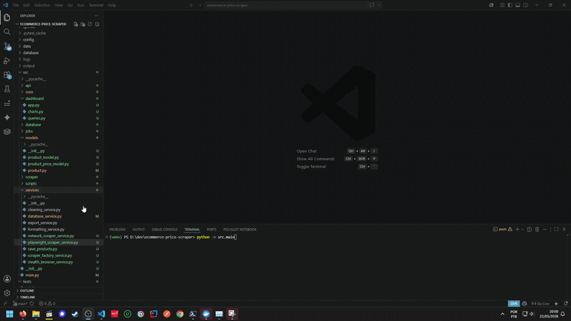

🇺🇸 English version available here:
[README.md](README.md)

# 🚀 E-commerce Price Scraper & Dashboard Analítico

Uma plataforma completa de web scraping e análise de dados desenvolvida com Python, PostgreSQL, SQLAlchemy, Streamlit, multithreading e estratégias modernas de coleta automatizada.

Este projeto foi desenvolvido para simular demandas reais de automação, scraping e engenharia de dados frequentemente encontradas em plataformas freelancer como Workana, Upwork e Fiverr.

---

## Dashboard


## Demonstração



# ✨ Funcionalidades

## 🔎 Web Scraping Avançado

* Scraping concorrente com multithreading
* Retry automático em falhas
* Rotação aleatória de User-Agent
* Parsing HTML com BeautifulSoup
* Arquitetura modular baseada em serviços
* Scraper Factory Pattern
* Estrutura escalável para múltiplos sites

---

## 🗄️ Integração com PostgreSQL

* ORM com SQLAlchemy
* Modelagem relacional
* Histórico de preços
* Criação automática de tabelas
* Persistência de produtos
* Versionamento temporal dos preços

---

## 📈 Dashboard Analítico

Dashboard interativo em Streamlit contendo:

* KPIs
* Distribuição de preços
* Análise de avaliações
* Histórico de preços
* Filtros dinâmicos
* Busca de produtos
* Consultas em tempo real no PostgreSQL
* Gráficos interativos com Plotly

---

## 📊 Exportação Automatizada

* Exportação para Excel
* Exportação para CSV
* Formatação automática
* Pipeline de limpeza de dados
* Arquivos prontos para análise

---

## 🧠 Destaques de Engenharia

* Arquitetura em camadas
* Design orientado a serviços
* Configuração via ambiente
* Estrutura escalável
* Compatível com Docker
* Sistema de logs organizado
* CLI customizada
* Banco normalizado

---

# 🏗️ Arquitetura

```text
src/
│
├── api/
├── core/
├── dashboard/
├── database/
├── jobs/
├── models/
├── scraper/
├── scripts/
├── services/
│
├── main.py
│
config/
database/
logs/
output/
tests/
```

---

# 🧩 Stack Tecnológica

| Tecnologia         | Finalidade                |
| ------------------ | ------------------------- |
| Python             | Linguagem principal       |
| PostgreSQL         | Banco de dados relacional |
| SQLAlchemy         | ORM                       |
| Streamlit          | Dashboard                 |
| Plotly             | Gráficos interativos      |
| BeautifulSoup      | Parsing HTML              |
| Requests           | Requisições HTTP          |
| Pandas             | Processamento de dados    |
| OpenPyXL           | Automação Excel           |
| Docker             | Containerização           |
| ThreadPoolExecutor | Concorrência              |

---

# 📦 Estrutura do Banco

## Products

| Coluna       | Tipo      |
| ------------ | --------- |
| id           | Integer   |
| title        | String    |
| rating       | String    |
| availability | Boolean   |
| created_at   | Timestamp |
| updated_at   | Timestamp |

---

## Product Prices

| Coluna     | Tipo        |
| ---------- | ----------- |
| id         | Integer     |
| product_id | Foreign Key |
| price      | Float       |
| scraped_at | Timestamp   |

---

# 📸 Dashboard

## Métricas disponíveis

* Total de produtos
* Preço médio
* Maior preço
* Tabela de produtos
* Histograma de preços
* Distribuição de avaliações
* Evolução histórica de preços

---

# ⚙️ Instalação

## 1. Clone o repositório

```bash
git clone <SEU_REPOSITORIO_GITHUB>
cd ecommerce-price-scraper
```

---

## 2. Crie o ambiente virtual

### Windows

```bash
python -m venv venv
venv\Scripts\activate
```

### Linux / Mac

```bash
python3 -m venv venv
source venv/bin/activate
```

---

## 3. Instale as dependências

```bash
pip install -r requirements.txt
```

---

# 🐘 Configuração PostgreSQL

## Docker Compose

```bash
docker-compose up -d
```

---

## Exemplo .env

```env
DB_HOST=localhost
DB_PORT=5432
DB_NAME=price_scraper
DB_USER=admin
DB_PASSWORD=admin
```

---

# ▶️ Executando o Scraper

```bash
python -m src.main
```

---

# 📊 Executando o Dashboard

```bash
streamlit run src/dashboard/app.py
```

---

# 🧪 Executando os Testes

## Teste de conexão PostgreSQL

```bash
python -m tests.raw_connection
```

## Teste SQLAlchemy

```bash
python -m tests.test_sqlalchemy
```

---

# 📁 Arquivos Gerados

A aplicação gera automaticamente:

* Relatórios Excel
* Exportações CSV
* Dados persistidos no PostgreSQL
* Histórico de preços
* Dashboard analítico
* Logs estruturados

---

# 🔥 Aplicações Reais no Mercado Freelancer

Este projeto demonstra competências frequentemente solicitadas em trabalhos de:

* Web scraping
* Monitoramento de preços
* Inteligência competitiva
* Engenharia de dados
* ETL
* Dashboards analíticos
* Automação empresarial
* Business intelligence
* Visualização de dados

---

# 🛠️ Melhorias Futuras

Planejamentos futuros:

* Integração com Selenium
* Integração com Playwright
* Bypass de CAPTCHA
* Rotação de proxies
* Agendamento automático
* API REST
* Backend FastAPI
* Predição de preços com IA
* Alertas automáticos
* Deploy em cloud
* Kubernetes

---

# 📌 Casos de Uso

## Monitoramento de E-commerce

Acompanhamento automatizado de preços concorrentes.

## Inteligência de Mercado

Monitoramento de tendências e variações de preço.

## Business Analytics

Geração de insights através de dashboards interativos.

## Relatórios Automatizados

Exportação estruturada para clientes e stakeholders.

---

# 📄 Licença

Este projeto está licenciado sob a MIT License.

---

# 👨‍💻 Autor

## Rogério Terciotte

Python Developer | Automation Engineer | Data & Web Scraping Enthusiast

* PostgreSQL
* Python Automation
* Web Scraping
* Data Engineering
* Dashboard Development
* API Integrations
* Process Automation

---

# ⭐ Por Que Este Projeto É Diferente

A maioria dos projetos de scraping para em coletar HTML bruto.

Este projeto vai além, implementando:

* Arquitetura escalável
* Persistência relacional
* Histórico temporal
* Dashboard analítico
* Conceitos de engenharia de dados
* Fluxos reais de automação

O objetivo foi construir algo próximo de entregas profissionais utilizadas em projetos freelancer reais e portfólios de backend/data engineering.
